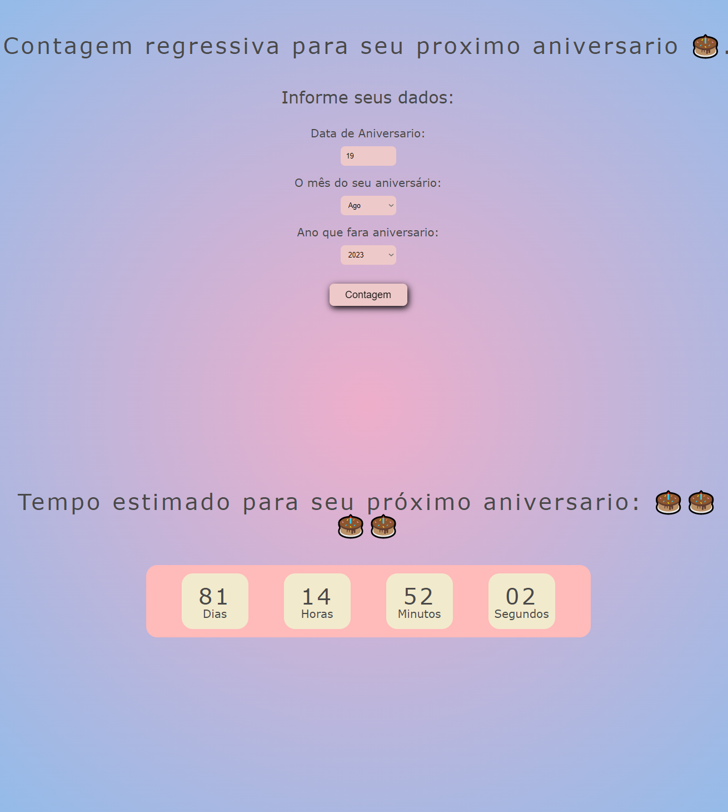

# DNC School

## Escola DNC Ciclo Iniciante
## Brincando com DOM

> Formação em Tecnologia

Projeto de um CountDown para seu próximo aniversario.

> [🔗 Clique aqui para acessar da Page](https://contagem-regressiva-para-seu-niver.netlify.app)

# 🧰🛠️ Tecnologias

- HTML
- CSS
- Git e Github
- Variavéis
- WEB
- Function
- JavaScript
- DOM

# 💛 Contato

sebastiaovitor18@gmail.com

[Linkedin](https://www.linkedin.com/in/sebastião-vitor-7a2870106/)
=======

Feito com base nas aulas que foram apresentadas até o momento. Decidi juntar tudo o que tinha aprendido com a DOM e fazer uma projeto que poderá me informar quanto tempo faltaria para uma data especial.

Ansioso para as próximas etapas.
😁bora codar.